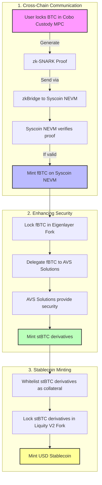

# Technical Whitepaper: USD Stablecoin Backed by BTC Collateral on Syscoin NEVM

## Abstract

This whitepaper outlines a system for creating a USD stablecoin backed by Bitcoin (BTC) collateral on the Syscoin NEVM chain. The architecture leverages zk-SNARKs for trustless cross-chain communication, an eigenlayer fork for enhanced security, and a fork of Liquity V2 for stablecoin minting. The solution aims to provide a secure, decentralized, and efficient stablecoin ecosystem with Bitcoin-level security.

---

## Table of Contents

1. Introduction
2. System Overview
3. Detailed Design
   3.1 Cross-Chain Communication with zkBridge
   3.2 Enhancing Security with Eigenlayer Fork
   3.3 Stablecoin Minting with Liquity V2 Fork
4. Technical Specifications
   4.1 Collateral Management
   4.2 zk-SNARK Implementation
   4.3 AVS Delegation Process
   4.4 Liquity V2 Fork Modifications
5. Security Considerations
6. Risk Assessment
7. Conclusion
8. References

---

## 1. Introduction

The decentralized finance (DeFi) ecosystem requires stablecoins that are secure, reliable, and backed by robust collateral. This whitepaper presents the design and technical specifications for a USD stablecoin backed by BTC collateral on Syscoin NEVM. It integrates several advanced technologies to ensure a decentralized, trustless, and secure stablecoin.

---

## 2. System Overview

The proposed system involves three main components:
1. **Cross-Chain Communication with zkBridge**: Ensuring trustless BTC to fBTC conversion on Syscoin NEVM using zk-SNARKs.
2. **Enhancing Security with Eigenlayer Fork**: Locking fBTC in an eigenlayer fork and delegating to Application Verification Services (AVS) for enhanced security.
3. **Stablecoin Minting with Liquity V2 Fork**: Using stBTC derivatives as collateral to mint a USD stablecoin on a Liquity V2 fork.

---

## 3. Detailed Design

### 3.1 Cross-Chain Communication with zkBridge

#### Overview

Polyhedra’s zkBridge is utilized for trustless cross-chain communication between Bitcoin and Syscoin NEVM. The bridge employs zero-knowledge proofs (zk-SNARKs) to ensure secure and efficient verification of transactions across chains.

#### Process

1. **BTC Locking on Bitcoin Chain**
   - Users lock BTC in Cobo custody, utilizing MPC (Multi-Party Computation) for secure management.
   - A zk-SNARK proof is generated to verify the BTC lock without revealing sensitive information.
   - The zk-SNARK proof is sent to Syscoin NEVM via zkBridge.
   - Syscoin NEVM runs a light client that verifies the proof.
   - Upon verification, an equivalent amount of fBTC is minted on Syscoin NEVM, representing the locked BTC.

### 3.2 Enhancing Security with Eigenlayer Fork

#### Overview

To enhance security, fBTC is locked in an eigenlayer fork. The eigenlayer allows fBTC holders to delegate their tokens to various Application Verification Services (AVS), thereby inheriting Bitcoin’s security.

#### Process

1. **Locking fBTC in Eigenlayer Fork**
   - Users lock fBTC in the eigenlayer fork, ensuring security through Bitcoin’s economic power.

2. **Delegation to AVS Solutions**
   - fBTC is delegated to AVS solutions like decentralized insurance markets, consensus models (e.g., Lx Chain), and BitcoinDA.

3. **Minting stBTC Derivatives**
   - Within the eigenlayer ecosystem, stBTC derivatives are minted, inheriting Bitcoin’s security properties.

### 3.3 Stablecoin Minting with Liquity V2 Fork

#### Overview

The final step uses stBTC derivatives as collateral in a Liquity V2 fork to mint a USD stablecoin. Liquity V2 provides a decentralized and governance-free protocol for minting stablecoins backed by crypto collateral.

#### Process

1. **Whitelisting stBTC Derivatives**
   - stBTC derivatives are whitelisted as collateral assets on the Liquity V2 fork.

2. **Collateral Management**
   - Users lock stBTC derivatives as collateral within the Liquity V2 system.

3. **Minting USD Stablecoin**
   - Users mint a USD stablecoin by locking stBTC derivatives, leveraging Liquity V2’s stability mechanisms.

---

## 4. Technical Specifications

### 4.1 Collateral Management

- **BTC Custody**: Managed by Cobo custody using MPC.
- **fBTC**: Minted on Syscoin NEVM upon verification of zk-SNARK proof.
- **stBTC**: Minted within Eigenlayer fork and used as collateral in Liquity V2.

### 4.2 zk-SNARK Implementation

- **Proof Generation**: Verifies BTC lock on Bitcoin chain.
- **Proof Transmission**: Sent to Syscoin NEVM via zkBridge.
- **Proof Verification**: Handled by Syscoin NEVM’s light client.

### 4.3 AVS Delegation Process

- **Delegation**: fBTC locked in Eigenlayer fork is delegated to AVS solutions.
- **Security**: AVS solutions provide additional security by leveraging Bitcoin’s economic power.

### 4.4 Liquity V2 Fork Modifications

- **Collateral Integration**: stBTC derivatives are whitelisted and managed within Liquity V2.
- **Stablecoin Minting**: Users mint USD stablecoins by locking stBTC derivatives.

---

## 5. Security Considerations

- **Custodial Security**: Ensuring the security of BTC custody through MPC.
- **zk-SNARK Proof Security**: Guaranteeing the integrity and confidentiality of zero-knowledge proofs.
- **AVS Security**: Validating the security and reliability of AVS solutions within the Eigenlayer fork.
- **Stablecoin Stability**: Maintaining the peg of the USD stablecoin through robust collateral management and Liquity V2 mechanisms.

---

## 6. Risk Assessment

### Custodial Risk

Reliance on Cobo’s MPC solution introduces custodial risk. Future plans include transitioning to a fully decentralized custody solution.

### Cryptographic Challenges

Implementing zk-SNARKs requires sophisticated cryptographic expertise. Ensuring the correctness and security of zk-SNARK proofs is crucial.

### Regulatory Compliance

The semi-permissioned nature of fBTC may raise regulatory concerns. Ensuring compliance with relevant jurisdictions and developing a clear roadmap towards full decentralization is essential.

### Cross-Chain Communication Reliability

Ensuring reliable and timely cross-chain communication between Bitcoin and Syscoin NEVM is critical. Addressing latency and message integrity is necessary for system robustness.

### Market Liquidity

Sufficient liquidity and market adoption of fBTC, stBTC, and the USD stablecoin are vital for system stability. Strategies to enhance liquidity and user trust must be developed.

---

## 7. Conclusion

This whitepaper presents a comprehensive approach to creating a USD stablecoin backed by BTC collateral on Syscoin NEVM. By leveraging zk-SNARKs, an eigenlayer fork, and Liquity V2, the system aims to provide a secure, decentralized, and efficient stablecoin ecosystem. Addressing potential risks and ensuring robust implementation at each step is crucial to the success of this innovative solution.

---

## 8. References

1. zk-SNARKs Overview: [Electric Coin Company](https://electriccoin.co/blog/snark-explained/)
2. Polyhedra zkBridge Documentation: [Polyhedra](https://polyhedra.medium.com/fully-trustless-cross-chain-bitcoin-token-swap-via-zkbridge-0e4dc2f919fe)
3. Syscoin NEVM Overview: [Syscoin Docs](https://docs.syscoin.org/docs/intro/syscoin-what/)
4. Eigenlayer Whitepaper: [Eigenlayer Whitepaper](https://docs.eigenlayer.xyz/assets/files/EigenLayer_WhitePaper-88c47923ca0319870c611decd6e562ad.pdf)
5. Eigenlayer AVS Examples: [Eigenlayer Docs](https://docs.eigenlayer.xyz/avs-examples/)
6. Eigenlayer Minting Process: [Eigenlayer Docs](https://docs.eigenlayer.xyz/minting-process/)
7. Liquity V2 Documentation: [Liquity V2 Whitepaper](https://liquity.gitbook.io/v2-whitepaper)
8. Liquity V2 Collateral Management

: [Liquity V2 Whitepaper](https://liquity.gitbook.io/v2-whitepaper/collateral-management)
9. Liquity V2 Minting Mechanisms: [Liquity V2 Whitepaper](https://liquity.gitbook.io/v2-whitepaper/minting-mechanisms)

---
