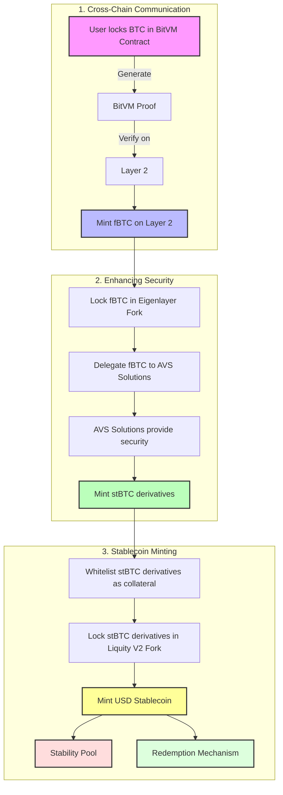

# Technical Whitepaper: USD Stablecoin Backed by BTC Collateral on Bitcoin Layer 2

## Abstract

This whitepaper outlines a system for creating a USD stablecoin backed by Bitcoin (BTC) collateral on a Bitcoin Layer 2 solution. The architecture leverages BitVM for trustless cross-chain communication, an eigenlayer fork for enhanced security, and a fork of Liquity V2 for stablecoin minting. The solution aims to provide a secure, decentralized, and efficient stablecoin ecosystem with Bitcoin-level security.

## Table of Contents

1. [Introduction](#introduction)
2. [System Overview](#system-overview)
3. [Detailed Design](#detailed-design)
   3.1 [Cross-Chain Communication with BitVM](#cross-chain-communication-with-bitvm)
   3.2 [Enhancing Security with Eigenlayer Fork](#enhancing-security-with-eigenlayer-fork)
   3.3 [Stablecoin Minting with Liquity V2 Fork](#stablecoin-minting-with-liquity-v2-fork)
4. [Technical Specifications](#technical-specifications)
   4.1 [Collateral Management](#collateral-management)
   4.2 [BitVM Implementation](#bitvm-implementation)
   4.3 [AVS Delegation Process](#avs-delegation-process)
   4.4 [Liquity V2 Fork Modifications](#liquity-v2-fork-modifications)
5. [Security Considerations](#security-considerations)
6. [Risk Assessment](#risk-assessment)
7. [Conclusion](#conclusion)
8. [References](#references)

## 1. Introduction

The decentralized finance (DeFi) ecosystem requires stablecoins that are secure, reliable, and backed by robust collateral. This whitepaper presents the design and technical specifications for a USD stablecoin backed by BTC collateral on a Bitcoin Layer 2 solution. It integrates several advanced technologies to ensure a decentralized, trustless, and secure stablecoin.

## 2. System Overview

The proposed system involves three main components:
1. **Cross-Chain Communication with BitVM**: Ensuring trustless BTC to fBTC conversion on the Layer 2 using BitVM.
2. **Enhancing Security with Eigenlayer Fork**: Locking fBTC in an eigenlayer fork and delegating to Application Verification Services (AVS) for enhanced security.
3. **Stablecoin Minting with Liquity V2 Fork**: Using stBTC derivatives as collateral to mint a USD stablecoin on a Liquity V2 fork.

## 3. Detailed Design

### 3.1 Cross-Chain Communication with BitVM

#### Overview

BitVM is utilized for trustless cross-chain communication between Bitcoin and the Layer 2 solution. BitVM employs a challenge-response protocol and fraud proofs to ensure secure and efficient verification of transactions across chains.

#### Process

1. **BTC Locking on Bitcoin Chain**
   - Users lock BTC in a BitVM contract on the Bitcoin chain.
   - A prover commits to the state of the locked BTC.
   - The commitment is verified by a verifier on the Layer 2.
   - Upon successful verification, an equivalent amount of fBTC is minted on the Layer 2, representing the locked BTC.

2. **BTC Unlocking and fBTC Burning**
   - Users initiate an fBTC burn on the Layer 2.
   - A prover commits to the burn transaction.
   - The verifier on the Bitcoin chain confirms the commitment.
   - Upon successful verification, the locked BTC is released to the user.

### 3.2 Enhancing Security with Eigenlayer Fork

#### Overview

To enhance security, fBTC is locked in an eigenlayer fork. The eigenlayer allows fBTC holders to delegate their tokens to various Application Verification Services (AVS), thereby inheriting Bitcoin's security.

#### Process

1. **Locking fBTC in Eigenlayer Fork**
   - Users lock fBTC in the eigenlayer fork, ensuring security through Bitcoin's economic power.

2. **Delegation to AVS Solutions**
   - fBTC is delegated to AVS solutions like decentralized insurance markets, consensus models (e.g., Lx Chain), and BitcoinDA.

3. **Minting stBTC Derivatives**
   - Within the eigenlayer ecosystem, stBTC derivatives are minted, inheriting Bitcoin's security properties.

### 3.3 Stablecoin Minting with Liquity V2 Fork

#### Overview

The final step uses stBTC derivatives as collateral in a Liquity V2 fork to mint a USD stablecoin. Liquity V2 provides a decentralized and governance-free protocol for minting stablecoins backed by crypto collateral.

#### Process

1. **Whitelisting stBTC Derivatives**
   - stBTC derivatives are whitelisted as collateral assets on the Liquity V2 fork.

2. **Collateral Management**
   - Users lock stBTC derivatives as collateral within the Liquity V2 system.

3. **Minting USD Stablecoin**
   - Users mint a USD stablecoin by locking stBTC derivatives, leveraging Liquity V2's stability mechanisms.

4. **Stability Pool**
   - A Stability Pool is implemented to absorb liquidated debt and maintain system solvency.

5. **Redemption Mechanism**
   - Users can redeem stablecoins for the underlying collateral at face value, ensuring a price floor.

## 4. Technical Specifications

### 4.1 Collateral Management

- **BTC Custody**: Managed by BitVM contracts on the Bitcoin chain.
- **fBTC**: Minted on the Layer 2 upon verification of BitVM proofs.
- **stBTC**: Minted within Eigenlayer fork and used as collateral in Liquity V2.

### 4.2 BitVM Implementation

- **Prover-Verifier Model**: Implements the BitVM prover-verifier model for cross-chain communication.
- **Fraud Proofs**: Utilizes BitVM's fraud proof system to ensure trustless verification.
- **Challenge-Response Protocol**: Implements BitVM's challenge-response mechanism for dispute resolution.

### 4.3 AVS Delegation Process

- **Delegation**: fBTC locked in Eigenlayer fork is delegated to AVS solutions.
- **Security**: AVS solutions provide additional security by leveraging Bitcoin's economic power.

### 4.4 Liquity V2 Fork Modifications

- **Collateral Integration**: stBTC derivatives are whitelisted and managed within Liquity V2.
- **Stablecoin Minting**: Users mint USD stablecoins by locking stBTC derivatives.
- **Trove System**: Implements Liquity's Trove system for managing individual collateralized debt positions.
- **Recovery Mode**: Incorporates a recovery mode to protect the system during extreme market conditions.

## 5. Security Considerations

- **BitVM Security**: Ensuring the integrity and reliability of BitVM proofs and challenge-response mechanisms.
- **AVS Security**: Validating the security and reliability of AVS solutions within the Eigenlayer fork.
- **Stablecoin Stability**: Maintaining the peg of the USD stablecoin through robust collateral management and Liquity V2 mechanisms.
- **Smart Contract Security**: Rigorous auditing and formal verification of all smart contracts in the system.

## 6. Risk Assessment

### BitVM Implementation Risks

Implementing BitVM requires sophisticated cryptographic expertise. Ensuring the correctness and security of BitVM proofs and the challenge-response protocol is crucial.

### Cross-Chain Communication Reliability

Ensuring reliable and timely cross-chain communication between Bitcoin and the Layer 2 is critical. Addressing latency and message integrity is necessary for system robustness.

### Market Liquidity

Sufficient liquidity and market adoption of fBTC, stBTC, and the USD stablecoin are vital for system stability. Strategies to enhance liquidity and user trust must be developed.

### Smart Contract Vulnerabilities

The complexity of the system increases the attack surface. Comprehensive security audits and formal verification of smart contracts are essential.

### Regulatory Compliance

The novel nature of BitVM and the Layer 2 solution may raise regulatory concerns. Ensuring compliance with relevant jurisdictions and developing a clear roadmap towards full decentralization is essential.

## 7. Conclusion

This whitepaper presents a comprehensive approach to creating a USD stablecoin backed by BTC collateral on a Bitcoin Layer 2 solution. By leveraging BitVM, an eigenlayer fork, and Liquity V2, the system aims to provide a secure, decentralized, and efficient stablecoin ecosystem. Addressing potential risks and ensuring robust implementation at each step is crucial to the success of this innovative solution.

## 8. References

1. BitVM Whitepaper: [BitVM: Compute Anything on Bitcoin](https://bitvm.org/bitvm.pdf)
2. Eigenlayer Whitepaper: [EigenLayer: Restaking Tokenized Stakes](https://docs.eigenlayer.xyz/assets/files/EigenLayer_WhitePaper-88c47923ca0319870c611decd6e562ad.pdf)
3. Eigenlayer AVS Examples: [EigenLayer Docs](https://docs.eigenlayer.xyz/avs-examples/)
4. Eigenlayer Minting Process: [EigenLayer Docs](https://docs.eigenlayer.xyz/minting-process/)
5. Liquity V2 Documentation: [Liquity V2 Whitepaper](https://liquity.gitbook.io/v2-whitepaper)
6. Liquity V2 Collateral Management: [Liquity V2 Whitepaper](https://liquity.gitbook.io/v2-whitepaper/collateral-management)
7. Liquity V2 Minting Mechanisms: [Liquity V2 Whitepaper](https://liquity.gitbook.io/v2-whitepaper/minting-mechanisms)

## System Architecture Diagram

